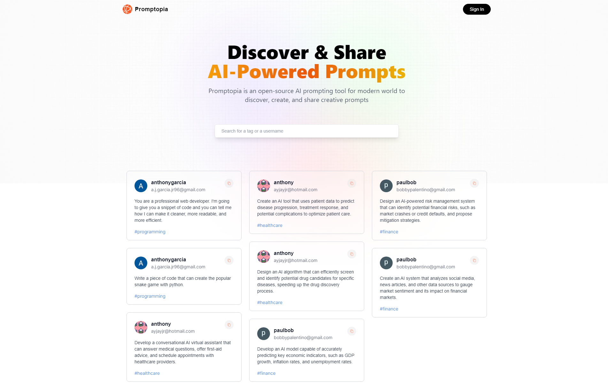
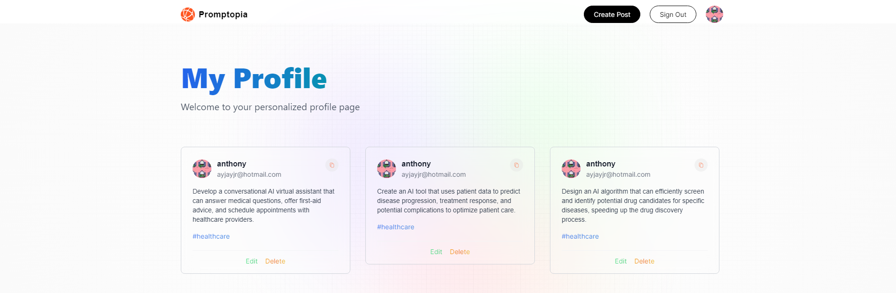
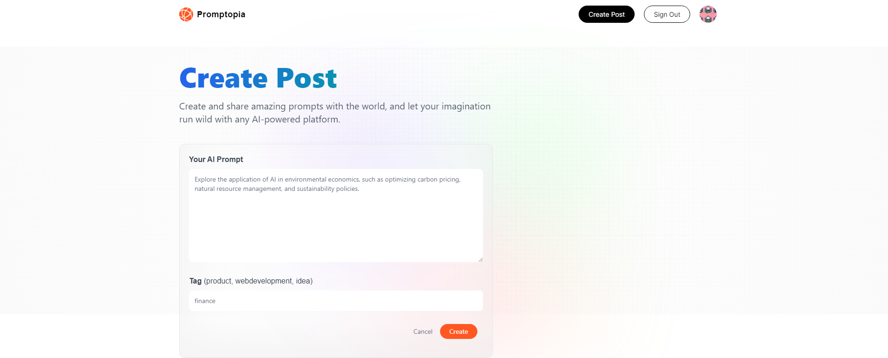
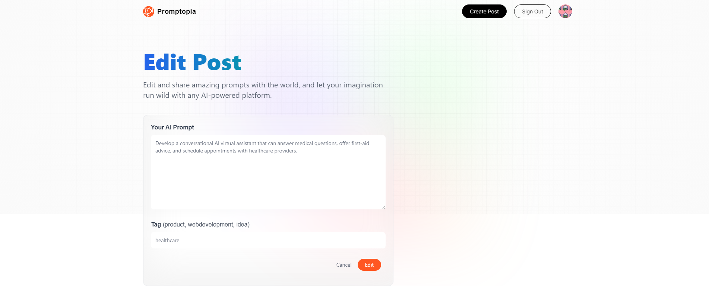

  

<h2>About the project</h2>

Embrace the power of artificial intelligence as you delve into a realm of creativity and inspiration like never before. Designed for both seasoned writers and aspiring storytellers, <strong>Promptopia</strong> is the ultimate platform to discover, create, and share AI-powered prompts.

▶ Live Demo: <a href="https://promptopia-ayjayjr.vercel.app">Promptopia</a>

<h3>Built with:</h3>

- React

- TailwindCSS

- Next.Js

- MongoDB Atlas

<h2>Screenshots of the Project 📸</h2>
 

  <h3>Home Page</h3>
  
Here you can discover and search through all the prompts shared by users. Click on a profile image and you will be taken to that user's profile.

  

 

  <h3>Profile Page</h3>
  
Your own profile page will list all the prompts you've created as well as allow you to edit or delete those prompts

  

 

  <h3>Create Page</h3>
  
Create new posts and post them to the main feed

  

 

  <h3>Edit Page</h3>
  
Edit any of your own existing prompts

  

